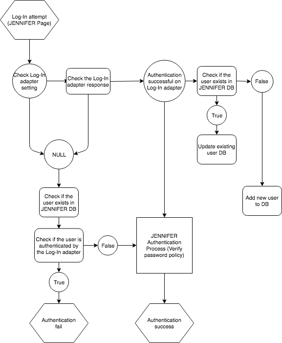
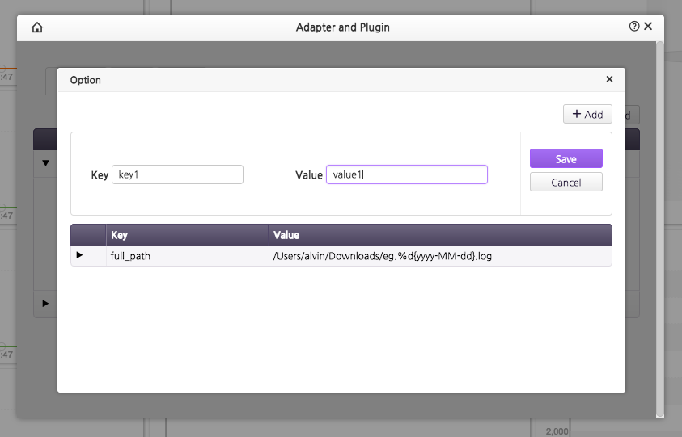

# JENNIFER Server Adapter

JENNIFER Server Adapter is an external module that can process transaction data or EVENT notification in real time. JENNIFER Server Adapter also allows users to create a variety of services in conjunction with E-Mail or SMS modules as with Open API. In addition, real-time transaction data, which may have a large amount of data depending on the environment, can be backed up or customized without significantly affecting the performance of the Jennifer server.

### Version Requirements

This document is based on Jennifer Server version 5.4.0.


## Configuring the adapter development environment in IntelliJ

Starting with `version 5.4.0`, you can build adapters by adding one Maven dependency even if Jennifer View Server is not installed.

1. Select File > New > Project... > Maven to create a new project
2. Enter the GroupId and ArtifactId for your project and click the Next button to create the project
3. Create a package in `src/main/java` directory to place your adapter code, following the `GroupId.ArtifactId` structure.
4. Add the configuration code for the `com.aries.extension` library and build-related MAVEN plugins to the [pom.xml](https://github.com/jennifersoft/jennifer-view-adapter-tutorial/blob/master/pom.xml) file.
> Note that GroupIDd can be set arbitrarily, unlike plugins, but we recommend using com.aries.


# Adapters Type 

## 1- X-View Transaction Adapter

You can receive real-time transaction data from the real-time X-View charts through adapter handlers. For example, if you want to store transactions data in a separate database instead of just Jennifer DB, you can use the transaction adapter to perform such task. The X-View transaction adapter class code looks like this:

``` java
package com.aries.tutorial;

import com.aries.extension.data.TransactionData;
import com.aries.extension.handler.TransactionHandler;
import com.aries.extension.util.PropertyUtil;

public class TransactionAdapter implements TransactionHandler {
    @Override
    public void on(TransactionData[] transactions) {
        System.out.println("[TransactionAdapter] - " +
                PropertyUtil.getValue("transaction", "subject", "Unknown subject"));

        for(TransactionData data : transactions) {
            System.out.println("Domain ID : " + data.domainId);
            System.out.println("Instance Name : " + data.instanceName);
            System.out.println("Transaction ID : " + data.txid);
            System.out.println("Response Time : " + data.responseTime);
            System.out.println("Application : " + data.applicationName);
        }
    }
}
```

Below is a list of properties of the `TransactionData` class.

| Variable type  | Property Name |
|:-------|-------:|
| short | domainId |
| String | domainName |
| int | instanceId |
| String | instanceName |
| String | guid |
| String | clientIp |
| long | clientId |
| String | userId |
| int | networkTime |
| int | frontendTime |
| long | startTime |
| long | endTime |
| int | responseTime |
| int | cpuTime |
| int | sqlTime |
| int | fetchTime |
| int | externalcallTime |
| String | errorType |
| String | applicationName |
| long | txid |

## 2- Event Notification Adaptaer

In order to receive data related to the EVENT occurrence through the adapter handler, the **External link** of the value set in the [ Management > EVENT Rule] menu must be activated. For example, if you want to receive data related to `AGENT_STOP` event in the adapter, then you must set the `AGENT_STOP` External link value to `On` from the Event Rule settings menu in JENNIFER Dashboard.
The EVENT notification adapter class code looks like this:

```java
package com.aries.tutorial;

import com.aries.extension.data.EventData;
import com.aries.extension.handler.EventHandler;
import com.aries.extension.util.PropertyUtil;

public class EventAdapter implements EventHandler {
    @Override
    public void on(EventData[] events) {
        System.out.println("[EventAdapter] - " +
                PropertyUtil.getValue("event", "subject", "Unknown subject"));

        for(EventData data : events) {
            System.out.println("Domain ID : " + data.domainId);
            System.out.println("Instance Name : " + data.instanceName);
            System.out.println("Transaction ID : " + data.txid);
            System.out.println("Service Name : " + data.serviceName);
            System.out.println("Error Type : " + data.errorType);
            System.out.println("Event Level : " + data.eventLevel);
        }
    }
}
```

Below is a list of the properties of the EventData class.

| Variable type | Property Name |
|:-------|-------:|
| short | domainId |
| String | domainName |
| int | instanceId |
| String | instanceName |
| long | time |
| String | errorType |
| String | metricsName |
| String | eventLevel |
| String | message |
| double | value |
| String | otype |
| String | detailMessage |
| String | serviceName |
| long | txid |

## 3- User Authentication Adapter

The User Authentication Adapter gives you the functionality to execute the authentication logic in the external module when trying to login to JENNIFER View Server. Using this adapter, you can integrate SSO authentication method for users authentications rather than using JENNIFER local authentication information.

### User authentication process

JENNIFER has two authentication methods. There is a traditional method of importing and authenticating user information from JENNIFER DB and an authentication method using login adapter. Login adapters are designed to be easier to customize with different authentication methods.



#### preHandle Method

Validate using pre-built authentication logic based on the ID and password entered by the user. If the authentication fails, it returns a `null` value, and if it succeeds, it creates a User object and returns it by specifying the relevant values.


#### redirect Method

If the authentication is successful, the user can specify the initial screen through the redirect method.

```java
package com.aries.tutorial;

import com.aries.extension.data.UserData;
import com.aries.extension.handler.LoginHandler;
import com.aries.extension.util.PropertyUtil;

public class LoginAdapter implements LoginHandler {
    @Override
    public UserData preHandle(String id, String password) {
        System.out.println("[LoginAdapter] - " +
                PropertyUtil.getValue("login", "subject", "Unknown subject"));

        if(id.equals("user1") && password.equals("password1")) {
            return new UserData(id, password, "admin", "Tester");
        }

        return null;
    }

    @Override
    public String redirect(String id, String password) {
        return "/dashboard/realtimeAdmin";
    }
}
```

Below is a list of the properties of the UserData class. Each property value is stored in the Jennifer user DB and can be seen on the view server screen.


| Variable Type | Property Name |
|:-------|-------:|
| String | id |
| String | password |
| String | groupId |
| String | name |
| String | email |
| String | company |
| String | dept |
| String | jobTitle |
| String | cellphone |


# Using Custom Options

You can add adapters that you have implemented directly in the `Management > Adapters and Plugin` section of the Jennifer View Server. Each adapter must have a unique ID value. This ID value is used later on for getting custom options/properties when implementing an adapter handler.


In the old versions of JENNIFER, when you wanted to pass properties to an adapter, you had to create a properties file and then reference it in your adapter code and load the properties values from there. Now you can dynamically add / modify / delete the options it via the Jennifer View Server administration screen. 



To get property value in the adapter you can call the `PropertyUtil.getValue` method. The first argument the `getValue` method takes is the Adapter `ID` you entered earlier when you added the adapter, and the second argument is your custom option key. The last third variable is the default value to be used if there is no value for that key.

```java

public class TransactionAdapter implements TransactionHandler {
    @Override
    public void on(TransactionData[] transactions) {

        //eventLog: is the Adapter ID
        //key1: is the custom propety key
        //Unknown subject: Default value to be ussed when there the key has no value
        PropertyUtil.getValue("eventLog", "key1", "Unknown subject"));
        ...
        ...
    }
```

## Using view server options

Option values ​​defined in the server_view.conf configuration file of the Jennifer View Server can be used within the adapter. The first parameter is the key name, and the second is the default value to be returned when there is no value.


```java
String db_path = com.aries.extension.util.ConfigUtil.getValue("db_path", "../db_view");
```