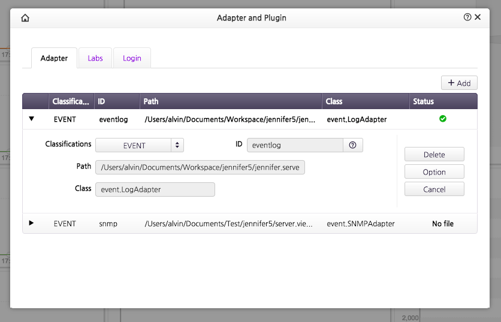

# JENNIFER Server Batch(Backup)

Jennifer Server Batch is an extension that is used to export statistical data in batches at specific times. The statistical data provided are Metrics and Application Service. It can be used to backup statistical data to an RDB such as Oracle or MS-SQL or exporting it as a CSV file.

## Version requirements

This document is based on Jennifer Server version 5.4.0.


# Configuring the development environment in IntelliJ

Starting with `version 5.4.0`, you can build adapters by adding one Maven dependency even if Jennifer View Server is not installed.

1. Select File > New > Project... > Maven to create a new project
2. Enter the GroupId and ArtifactId for your project and click the Next button to create the project
3. Create a package in `src/main/java` directory to place your adapter code, following the `GroupId.ArtifactId` structure.
4. Add the configuration code for the `com.aries.extension` library and build-related MAVEN plugins to the [pom.xml](https://github.com/jennifersoft/jennifer-view-batch-tutorial/blob/master/pom.xml) file.
> Note that GroupIDd can be set arbitrarily, unlike plugins, but we recommend using com.aries.


# General

#### preHandle Method

The preHandler receives as an argument the time at which the batch was started, it must return `true` in order for the `process` method to be executed. You can use it for example, to create a table schema before storing the data in the RDB.

#### process Method

Unlike an adapter, an array of non-class interfaces (Batch data) are received as arguments and must be cast using the batch data type.

# Metrics Batch

The data that can be retrieved from the DB search analysis screen is transferred through the batch handler.


#### Domain

The following is an example of receiving Domain Metrics data.

```java
    package com.aries.tutorial;

    import com.aries.extension.data.BatchData;
    import com.aries.extension.data.batch.MetricsDataAsDomain;
    import com.aries.extension.handler.BatchHandler;
    import com.aries.extension.util.PropertyUtil;

    public class DomainMetricsBatch implements BatchHandler {
        @Override
        public boolean preHandle(long batchTime) {
            // TODO: Adding pre-processing code
            return true;
        }

        @Override
        public void process(BatchData[] batchData) {
            System.out.println("[DomainMetricsBatch] - " +
                    PropertyUtil.getValue("domain_metrics_batch", "subject", "Unknown subject"));

            for(int i = 0; i < batchData.length; i++) {
                MetricsDataAsDomain data = (MetricsDataAsDomain) batchData[i];

                System.out.println("Domain ID : " + data.domainId);
                System.out.println("Domain Name : " + data.domainName);
                System.out.println("Call Count : " + data.serviceCount);
                System.out.println("Max TPS : " + data.maxTps);
                System.out.println("Active Service : " + data.activeService);
                System.out.println("Error Count : " + data.errorCount + "\n");
            }
        }
    }
```

#### Instance
    MetricsDataAsInstance data = (MetricsDataAsInstance) batchData[i];
    
#### Business
    MetricsDataAsBusiness data = (MetricsDataAsBusiness) batchData[i];

# Application Service Batch

The data that can be retrieved from the application status analysis screen is transferred through the batch handler. 

```java
    package com.aries.tutorial;

    import com.aries.extension.data.BatchData;
    import com.aries.extension.data.batch.ApplicationServiceData;
    import com.aries.extension.handler.BatchHandler;
    import com.aries.extension.util.PropertyUtil;

    public class ApplicationServiceBatch implements BatchHandler {
        @Override
        public boolean preHandle(long batchTime) {
            // TODO: Adding pre-processing code
            return true;
        }

        @Override
        public void process(BatchData[] batchData) {
            System.out.println("[ApplicationServiceBatch] - " +
                    PropertyUtil.getValue("application_service_batch", "subject", "Unknown subject"));

            for(int i = 0; i < batchData.length; i++) {
                ApplicationServiceData data = (ApplicationServiceData) batchData[i];

                System.out.println("Domain ID : " + data.domainId);
                System.out.println("Domain Name : " + data.domainName);
                System.out.println("Instance Name : " + data.instanceName);
                System.out.println("Application Name : " + data.applicationName);
                System.out.println("Call Count : " + data.callCount);
                System.out.println("Failure Count : " + data.failureCount + "\n");
            }
        }
    }
```


# Using Custom Options

You can add adapters that you have implemented directly in the `Management > Adapters and Plugin` section of the Jennifer View Server. Each adapter must have a unique ID value. This ID value is used later on for getting custom options/properties when implementing an adapter handler.



In the old versions of JENNIFER, when you wanted to pass properties to an adapter, you had to create a properties file and then reference it in your adapter code and load the properties values from there. Now you can dynamically add / modify / delete the options it via the Jennifer View Server administration screen. 


To get property value in the adapter you can call the `PropertyUtil.getValue` method. The first argument the `getValue` method takes is the Adapter `ID` you entered earlier when you added the adapter, and the second argument is your custom option key. The last third variable is the default value to be used if there is no value for that key.

```java

public class TransactionAdapter implements TransactionHandler {
    @Override
    public void on(TransactionData[] transactions) {

        //eventLog: is the Adapter ID
        //key1: is the custom propety key
        //Unknown subject: Default value to be ussed when there the key has no value
        PropertyUtil.getValue("eventLog", "key1", "Unknown subject"));
        ...
        ...
    }
```

## Using view server options

Option values ​​defined in the server_view.conf configuration file of the Jennifer View Server can be used within the adapter. The first parameter is the key name, and the second is the default value to be returned when there is no value.


```java
String db_path = com.aries.extension.util.ConfigUtil.getValue("db_path", "../db_view");
```